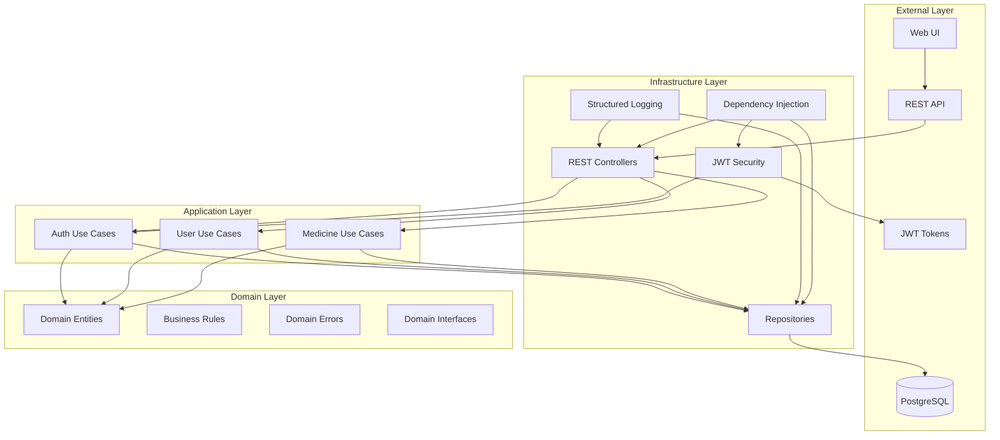
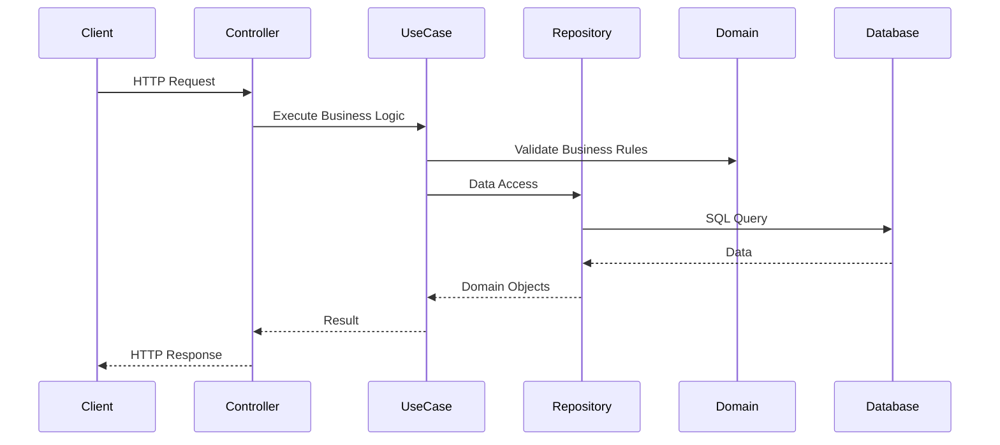
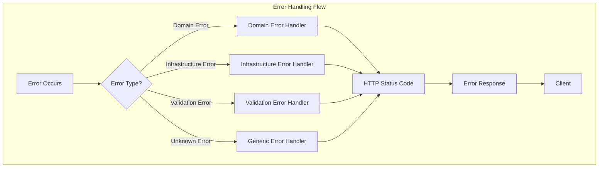

# Caregiver Microservices Application

This project is a microservices-based backend application built in Go, designed to manage caregiver-related functionalities such as user management and scheduling. It adheres to modern architectural principles to ensure scalability, maintainability, and testability.

## Architecture Overview

This application strictly adheres to **Clean Architecture** principles. This design philosophy ensures a clear separation of concerns, making the codebase highly testable, maintainable, and independent of external frameworks.

### Key Principles:

- **Separation of Concerns**: Clear boundaries are established between business rules, application logic, and external dependencies.
- **100% Testability**: The core business logic (use cases) is independent of external frameworks, allowing for easy and isolated testing with mocks.
- **Framework Independence**: The application's core logic does not depend on specific web frameworks, databases, or external services. This flexibility allows for easier technology swaps or upgrades in the future without impacting the core business rules.
- **Dependency Rule**: A fundamental rule of Clean Architecture is that dependencies always point inwards. Outer layers (like `infrastructure`) depend on inner layers (like `application` and `domain`), but inner layers have no knowledge of outer layers.

### Layered Structure:

The application is organized into three primary layers:

- `domain/`: The innermost layer. This layer contains the core business entities (e.g., `User`, `Schedule`, `Medicine`), fundamental business rules, and interfaces (contracts) that define how outer layers will interact with the domain. It is completely independent of any external frameworks or technologies.
- `application/`: This layer encapsulates the application-specific business logic, often referred to as "Use Cases" or "Interactors." Use cases orchestrate the flow of data to and from the domain entities and interact with interfaces defined in the domain layer (e.g., repository interfaces). They are responsible for validating business rules and coordinating operations.
- `infrastructure/`: The outermost layer. This layer contains the concrete implementations of interfaces defined in the inner layers. This includes implementations for databases, web frameworks, external services, logging, and security. It adapts external technologies to the application's specific needs.

### Architectural Diagram:

### Use Case Flow:

## Key Technologies and Libraries

This project leverages several key Go libraries to implement its functionalities and adhere to the Clean Architecture principles:

- **Gin Gonic (`github.com/gin-gonic/gin`)**:
  - **Purpose**: A high-performance HTTP web framework.
  - **Rationale**: Chosen for its speed, robust routing capabilities, and extensive middleware support, providing an efficient and flexible way to handle HTTP requests and responses.
- **GORM (`gorm.io/gorm`, `gorm.io/driver/postgres`)**:
  - **Purpose**: An Object-Relational Mapper (ORM) for Go, specifically used with PostgreSQL.
  - **Rationale**: Selected for its ease of use in mapping Go structs to database tables, simplifying CRUD (Create, Read, Update, Delete) operations, database migrations, and complex queries, while abstracting away raw SQL.
- **Go-Playground Validator (`github.com/go-playground/validator/v10`)**:
  - **Purpose**: A powerful and flexible Go package for struct and field validation.
  - **Rationale**: Utilized for robust request payload validation, ensuring data integrity at the API entry point using struct tags (e.g., `binding:"required"`).
- **Go-JWT (`github.com/golang-jwt/jwt/v4`)**:
  - **Purpose**: A library for creating and parsing JSON Web Tokens (JWTs).
  - **Rationale**: Essential for implementing secure authentication and authorization, allowing the generation of both access and refresh tokens with custom claims and expiration times.
- **Zap Logger (`go.uber.org/zap`)**:
  - **Purpose**: A fast, structured, and leveled logging library.
  - **Rationale**: Chosen for its exceptional performance and ability to produce machine-readable (JSON) logs, which are crucial for effective monitoring, debugging, and analysis in production environments.
- **Go-Crypto (`golang.org/x/crypto`)**:
  - **Purpose**: A collection of cryptographic packages.
  - **Rationale**: Specifically, the `bcrypt` sub-package is used for securely hashing user passwords, ensuring that sensitive credentials are never stored in plain text in the database.
- **Google UUID (`github.com/google/uuid`)**:
  - **Purpose**: For generating universally unique identifiers (UUIDs).
  - **Rationale**: Used for primary keys in database entities, providing globally unique and non-sequential identifiers, which is beneficial in distributed systems and prevents predictable ID generation.
- **Testify (`github.com/stretchr/testify`)**:
  - **Purpose**: A popular Go testing toolkit.
  - **Rationale**: Provides assertion functions and mocking capabilities, significantly simplifying the writing of clear, concise, and robust unit and integration tests.
- **Go-SQLMock (`github.com/DATA-DOG/go-sqlmock`)**:
  - **Purpose**: A library for mocking SQL database interactions.
  - **Rationale**: Crucial for unit testing repository layers without requiring an actual database connection, enabling fast, isolated, and reliable tests of database interaction logic.
- **Godog (`github.com/cucumber/godog`)**:
  - **Purpose**: A Behavior-Driven Development (BDD) framework for Go.
  - **Rationale**: Used for writing high-level, human-readable integration tests that describe application behavior from a user's perspective, fostering collaboration between technical and non-technical stakeholders.
- **Gin-Contrib CORS (`github.com/gin-contrib/cors`)**:
  - **Purpose**: A Gin middleware for handling Cross-Origin Resource Sharing (CORS).
  - **Rationale**: Configured to manage which origins are allowed to access the API, enhancing security for web applications by preventing unauthorized cross-origin requests.

## Application Structure and Components

The `src/` directory is the heart of the application, organized according to Clean Architecture principles:

### `src/domain/`

This layer contains the core business logic and data structures, completely independent of external frameworks.

- `user/`, `schedule/`, `medicine/`: These sub-packages define the Go structs for domain entities (e.g., `User`, `Schedule`, `Medicine`) and their associated interfaces (e.g., `UserRepositoryInterface`). These interfaces act as contracts that the `infrastructure` layer must implement.
- `errors/`: Custom error types (e.g., `NotFound`, `ValidationError`, `NotAuthenticated`, `RepositoryError`) are defined here. This provides a standardized and semantically rich way to handle and categorize application errors across all layers, improving error clarity and debugging.

### `src/application/usecases/`

This layer encapsulates the application's specific business logic, often referred to as "Use Cases" or "Interactors."

- `auth/`, `user/`, `schedule/`: Each sub-package contains the implementation of a specific use case (e.g., `AuthUseCase`, `UserUseCase`, `ScheduleUseCase`). These use cases receive input, apply business rules, interact with domain entities and repositories (via their interfaces), and return results. For example, the `AuthUseCase` handles user login and token refreshing by interacting with the `UserRepositoryInterface` and `IJWTService` interfaces, ensuring business logic is decoupled from data access and security implementation details.

### `src/infrastructure/`

This layer houses all external concerns and concrete implementations, adapting them to the application's needs.

- **`di/` - Dependency Injection Container**:

  - The `ApplicationContext` struct acts as the central dependency container for the entire application.
  - The `SetupDependencies` function is responsible for initializing all concrete implementations (e.g., database connection via `psql.InitPSQLDB`, JWT service via `security.NewJWTService`, and various repository implementations like `userRepo.NewUserRepository`) and then injecting these dependencies into their respective use cases and controllers.
  - The `GetLogger` function uses `sync.Once` to ensure that the logger instance is initialized only once across the application's lifecycle, promoting efficient resource management.
  - This setup promotes loose coupling, making components easily swappable and testable.

- **`logger/` - Logging**:

  - Implements structured logging using `go.uber.org/zap`.
  - `NewLogger()` and `NewDevelopmentLogger()` configure the logger for different environments (e.g., production vs. development), allowing for varying levels of detail and output formats.
  - The `SetupGinWithZapLogger` functions integrate Zap with the Gin framework by overriding `gin.DefaultWriter` and `gin.DefaultErrorWriter`, ensuring that all Gin-related logs (e.g., request access logs, Gin errors) are structured and captured by Zap.
  - The `GinBodyLogMiddleware` (found in `src/infrastructure/rest/middlewares/Interceptor.go`) captures and logs full HTTP request and response bodies, status codes, and errors, which is invaluable for debugging and auditing API interactions.
  - GORM logging is also integrated via `NewGormLogger`, providing detailed logs of database queries, including slow query warnings.

- **`repository/psql/` - ORM and Database Interaction**:

  - Manages the application's interaction with the PostgreSQL database using GORM.
  - `DatabaseConfig`: A struct that holds database connection details, loaded securely from environment variables.
  - `GetDSN()`: Constructs the database connection string from the loaded configuration.
  - `InitDatabase()`: This function establishes the GORM database connection and performs automatic migrations using `MigrateEntitiesGORM()` for `User`, `Schedule`, and `Task` models, ensuring the database schema is up-to-date. It also integrates `gormlogger` for detailed database query logging.
  - `user/`, `schedule/`: These sub-packages contain concrete implementations of the repository interfaces defined in the `domain` layer (e.g., `UserRepository`). These implementations interact directly with GORM to perform database operations (CRUD, search, etc.), translating domain objects to database records and vice-versa.

- **`rest/` - RESTful API Layer**:

  - **`controllers/` - Controllers**:
    - Act as the entry points for HTTP requests. They receive requests, parse input (using `controllers.BindJSON`, which leverages `go-playground/validator` for initial validation), invoke the appropriate use cases to execute business logic, and then format the HTTP responses.
    - For example, `AuthController` handles `/auth/login` and `/auth/access-token` endpoints, delegating the core business logic to the `AuthUseCase`. Errors returned from use cases are propagated via `ctx.Error` and are then handled by the centralized error handling middleware.
  - **`middlewares/` - Middleware**:
    - Gin middleware functions applied to routes to perform cross-cutting concerns before or after request processing.
    - `Interceptor.go`: The `GinBodyLogMiddleware` captures and logs detailed request and response information, including full request/response bodies, status codes, and any errors, providing a comprehensive audit trail.
    - `errorHandler.go`: This is a crucial centralized error handling middleware. It intercepts errors propagated by controllers (via `ctx.Error`), identifies their custom `domain/errors.ErrorType`, and maps them to appropriate HTTP status codes and consistent JSON error responses, ensuring clear and predictable error feedback to API consumers.
    - `Headers.go`: Sets standard security headers (e.g., `X-Content-Type-Options`, `X-Frame-Options`, `Content-Security-Policy`) for all responses, enhancing the application's security posture against common web vulnerabilities.
    - `RequiresLogin.go`: Authenticates incoming requests by validating JWT access tokens. This middleware ensures that protected API endpoints are only accessible by authenticated users, enforcing access control.
  - **`routes/` - Endpoints/Routes**:
    - Defines the API endpoints and maps them to specific controller methods.
    - `routes.go` sets up the main Gin router, including a basic health check endpoint (`/v1/health`), and groups versioned routes (e.g., `/v1`). It then delegates to specific route files like `auth.go`, `user.go`, and `schedule.go` to define their respective endpoints, injecting controllers from the `ApplicationContext`. This modular approach keeps route definitions organized.

- **`security/` - Security (JWT)**:
  - Implements JWT token generation and verification.
  - `JWTService`: Provides methods to `GenerateJWTToken` (for both access and refresh tokens) and `GetClaimsAndVerifyToken`. It securely loads JWT secrets and expiration times from environment variables (`JWT_ACCESS_SECRET_KEY`, `JWT_REFRESH_SECRET_KEY`, `JWT_ACCESS_TIME_MINUTE`, `JWT_REFRESH_TIME_HOUR`), ensuring sensitive data is not hardcoded.
  - `AppToken` and `Claims` structs define the structure of the generated tokens and their payloads, including `userID` and `tokenType`, allowing for flexible token management.

## Validation

The application employs a multi-layered validation strategy to ensure data integrity:

- **Request Payload Validation**: Primarily handled at the controller layer using `go-playground/validator/v10`. Request structs (e.g., `LoginRequest` in [`src/infrastructure/rest/controllers/auth/Structures.go`](src/infrastructure/rest/controllers/auth/Structures.go)) use `binding:"required"` and other validation tags to ensure basic data format and presence.
- **Custom Validation**: For more complex or dynamic validation scenarios, custom validation logic is implemented. An example is `updateValidation` in [`src/infrastructure/rest/controllers/user/Validation.go`](src/infrastructure/rest/controllers/user/Validation.go), which dynamically validates fields in an update request map based on predefined rules.
- **Business Rule Validation**: Performed within the use cases. This ensures that operations adhere to the application's core business rules and invariants before interacting with the persistence layer, preventing invalid states.

## Error Handling

The application features a robust and centralized error handling mechanism:

### Error Flow:

- Custom error types are defined in the `src/domain/errors` package (e.g., `NotFound`, `ValidationError`, `NotAuthenticated`, `RepositoryError`).
- The `NewAppError` function is used to wrap underlying Go errors with a specific `ErrorType`, providing context and categorization.
- The `errorHandler` middleware (in `src/infrastructure/rest/middlewares/errorHandler.go`) intercepts errors propagated by controllers (via `ctx.Error`). It identifies their `ErrorType` and maps them to appropriate HTTP status codes and consistent JSON error responses, ensuring clear, predictable, and developer-friendly error feedback to API consumers.

## Testing Strategy

The project is committed to a comprehensive testing approach, following the **Test Pyramid** concept to ensure high quality and reliability:

- **Unit Tests**:
  - **Focus**: Individual components (e.g., use cases, controllers, services) in isolation.
  - **Implementation**: Mocks (e.g., `mockUserRepository`, `mockJWTService` in `auth_test.go`) are extensively used with `github.com/stretchr/testify` for assertions and `github.com/DATA-DOG/go-sqlmock` for mocking database interactions. This allows for fast, reliable, and isolated testing of business logic without external dependencies.
- **Integration Tests**:
  - **Focus**: Verify the interaction between multiple components, particularly API endpoints and their underlying use cases and repositories.
  - **Implementation**: `github.com/cucumber/godog` is used for Behavior-Driven Development (BDD) style integration tests. These tests are written in a human-readable Gherkin syntax, allowing for high-level, scenario-based testing of the API's behavior from a user's perspective.
- **Test Pyramid**: The project adheres to the Test Pyramid, emphasizing a large base of fast unit tests, a smaller layer of integration tests, and a minimal number of end-to-end tests (though not explicitly detailed in this README, the BDD framework supports this).

## Conclusion

This application is designed for high performance, scalability, maintainability, and testability, leveraging Go's efficiency and adhering to the robust principles of Clean Architecture. The chosen libraries and structured approach provide a solid foundation for current functionalities and future development and expansion.
